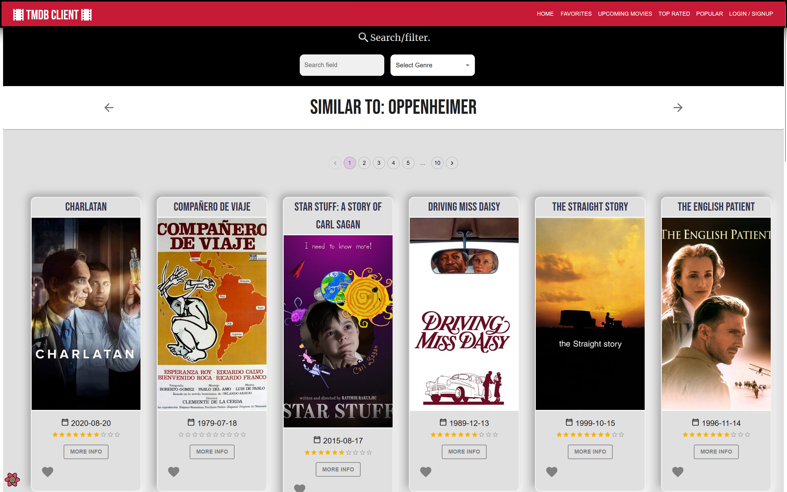
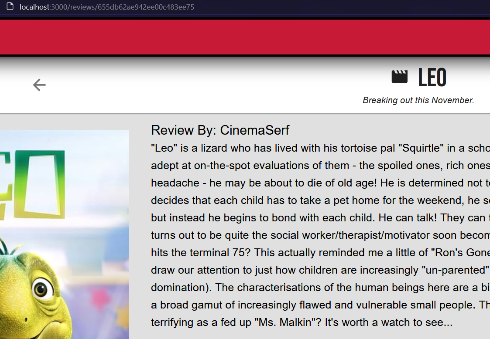
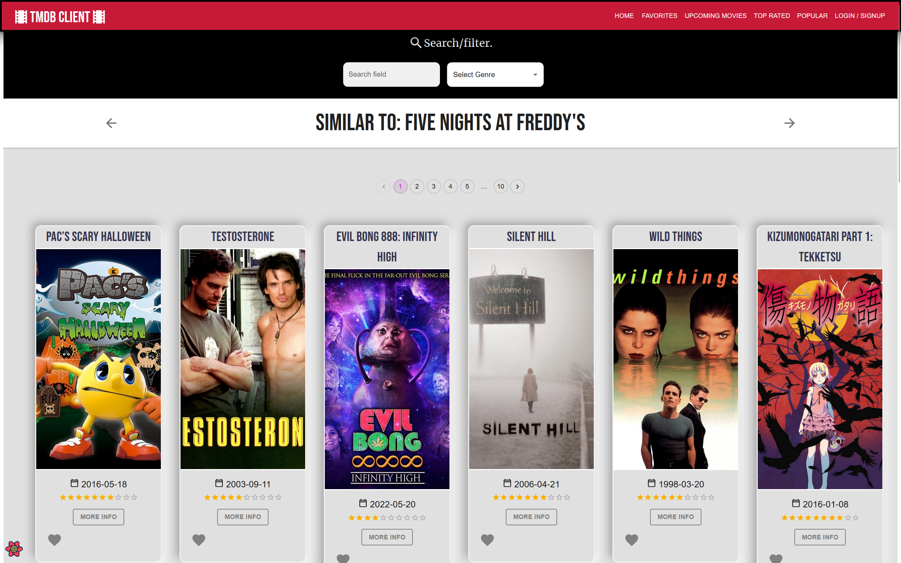

# Assignment 1 - ReactJS app.

### Overview.

This repository contains the code for the first assignment of the Web App Development 2 module. The assignment is to create a ReactJS web application that consumes a RESTful API. The web application is a movie fan application that allows users to view movie details, reviews, and actors. The web application also allows users to create an account and login to the application. The web application also allows users to view upcoming, top rated, and popular movies. The web application also allows users to view similar movies and actors starring in a movie.


### Features added by me.

+ Firebase Authentication

    

    <div style='display: inline-flex;'>
    
    <!-- 
    
    </div>
     -->


+ Movie cast page

    

+ Similar movies page

    
+ Upcoming movies page
+ Top rated movies page
+ Popular movies page
+ Pagination feature

    

+ Movie images in details page only display in English
+ Restyled components with custom fonts and colors

## Setup requirements.
1. Create a .env fille in the root directory with the following structure
````
REACT_APP_TMDB_KEY=.............................
REACT_APP_FIREBASE_API_KEY=.....................................
REACT_APP_FIREBASE_MESSAGING_SENDER_ID=.............
FAST_REFRESH=false
````
2. login/signup to firebase and create/open an existing a project

3. Click on the web icon to create a web app

4. Copy the API key and messaging sender id and paste them in the .env file

5. Login or signup to TMDB and create/open an existing project, find the API key and paste it in the .env file
6. Run the following commands in the root directory:
````
npm i
npm start
````


## API endpoints.

The following is a list of the API endpoints I included in my web application.


+ /reviews/form 
+ /authentication 
+ /movies/favorites 
+ /movies/upcoming 
+ /movies/topRated

+ movies/popular 

+ /reviews/:id 



## Routing.

[ List the __new routes__ supported by your app and state the associated page.]

+ /movies/:id
+ /actors/:id
+ /movies/similar-to/:id
+ /actors/staring-in/:id


### Similar Movies Section




## Independent learning.

Itemize the technologies/techniques you researched independently and adopted in your project, 
i.e. aspects not covered in the lectures/labs. Include the source code filenames that illustrate these 
(we do not require code excerpts) and provide references to the online resources that helped you (articles/blogs).

TMDB API docs had helped me significantly in understanding how to use the API endpoints and how to use the API key in my web application.


### Restyled components

I decided to apply some tweaks to the user interface/experience aspect of the web application. I change the filter card into a header.
Applied custom fonts and colors to the web application.


###  Added new MUI components


###  Learned Firebase Authentication

The followoing YouTube tutorail helped me immensely in learning how to use Firebase Authentication in my web application:

I took the following code from the tutorial and modified it to suit my web application by restyling it and allocating a separate page: authenticationPage.jsx

This gave me more experience with the use of an API in web application development

[](http://www.youtube.com/watch?v=9bXhf_TELP4)